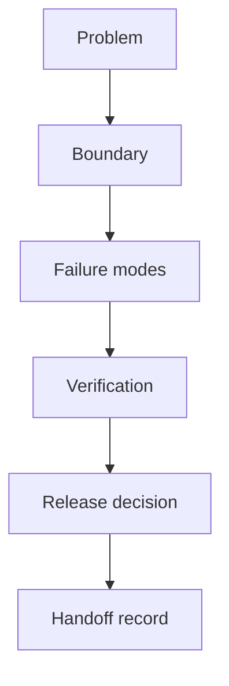

# DARUMA Methodology

A public working draft of the engineering standards KAMPO uses to reason about small automation projects. It turns vague expectations—“clean code”, “safe deploy”, “good tests”—into reviewable questions and target practices.

> Status: **documentation framework in development**. The repository contains three standards documents. It does not currently include templates, checklists, deployment automation or a claim of compliance by every KAMPO experiment.

## Why this exists

Automation projects often fail outside the happy path: ownership is unclear, credentials leak into exports, retries duplicate actions, and nobody knows how to recover. DARUMA provides a shared vocabulary for discussing those risks before delivery.

## Current documents

| Document | Focus | Use it when |
| --- | --- | --- |
| [`CODE_STYLE.md`](standards/CODE_STYLE.md) | boundaries, naming and explicit errors | defining or reviewing TypeScript structure |
| [`GIT_WORKFLOW.md`](standards/GIT_WORKFLOW.md) | branches, commits and review flow | deciding how changes reach `main` |
| [`TEST_STRATEGY.md`](standards/TEST_STRATEGY.md) | test layers and failure cases | writing a project-specific test plan |

These are reference targets. A project should adopt only the rules it can verify, record exceptions and avoid displaying badges or metrics it cannot substantiate.

## Review model

## Minimum delivery questions

### 1. Problem and boundary

- What outcome is the system responsible for?
- Which actions require human approval?
- Which providers, credentials and data classes are in scope?

### 2. Failure behavior

- Can a retry duplicate an external action?
- What happens when one provider fails after another succeeds?
- Where can an operator inspect state and recover work?

### 3. Evidence

- Which validation commands actually exist in the repository?
- Which scenarios were manually verified?
- Which limitations remain and who owns them?

### 4. Handoff

- Can another person run, diagnose and disable the system?
- Are credentials separated from code and exports?
- Is there a rollback or safe-stop procedure appropriate to the risk?

## How to use the repository

1. Select the standard relevant to the project.
2. Convert applicable rules into acceptance criteria.
3. Record deviations with their reason and owner.
4. Link each completed criterion to code, a test, a run or a review note.
5. Update the standard only after a real project exposes a better rule.

## Principles

- **Evidence over theatre.** No invented uptime, coverage or deployment claims.
- **Small reversible changes.** Reduce the cost of discovering a wrong assumption.
- **Explicit side effects.** Network, storage and messaging actions remain visible.
- **Human control for sensitive actions.** Approval is part of architecture, not an afterthought.
- **Documentation matches the repository.** If a file or command is not present, it is not advertised.

## Roadmap

- Add a lightweight discovery brief.
- Add a pre-release risk checklist.
- Add one architecture-decision template.
- Apply the standards to a repository and link the resulting evidence.
- Version the documents after they have been tested in practice.

## Contributing

Open a focused pull request that identifies the failure mode the proposed rule prevents. Examples are more useful than absolute language.

---

Maintained by [KAMPO](https://velizmurillofrabrizzio-lab.github.io/daruma.github.io/), an independent systems studio led by Yosimar.
